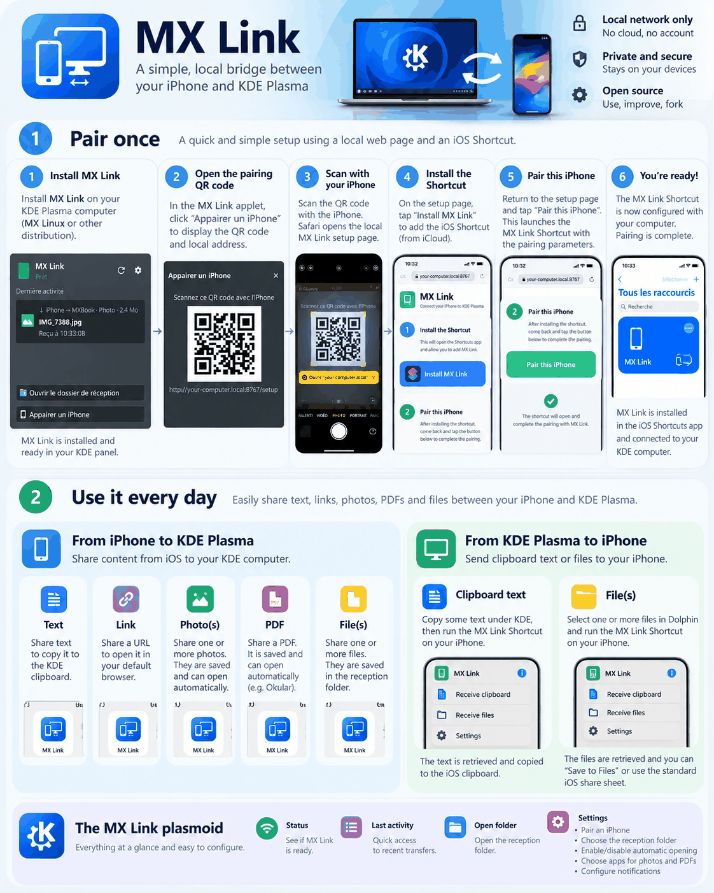

# MX Link

**MX Link est une passerelle locale iPhone ↔ KDE Plasma pour le texte, les liens, les photos, les PDF et les fichiers.**

L’objectif est de retrouver une expérience proche de Handoff/AirDrop tout en restant local : pas de stockage cloud, pas de VPN et pas de port exposé sur Internet.

[](mx-link-overview.png)

> **Version :** `0.1.2-alpha`
> **Statut :** alpha publique — fonctionnelle, mais encore destinée aux tests.

## Configuration visée

Cette alpha cible actuellement :

- KDE Plasma
- MX Linux / distributions basées sur Debian
- un iPhone avec l’app Raccourcis d’Apple
- les deux appareils sur le même réseau local

D’autres distributions peuvent fonctionner, mais l’installateur utilise actuellement les noms de paquets Debian et `dpkg`.

## Ce que fait MX Link

### iPhone → Linux

Depuis la feuille de partage iOS, lancez **MX Link** pour envoyer :

- du texte → copié dans le presse-papiers KDE
- une URL → ouverte dans le navigateur par défaut
- une ou plusieurs photos → enregistrées localement, avec ouverture facultative
- un PDF → enregistré localement, avec ouverture facultative
- un autre fichier → enregistré localement

### Linux → iPhone

Sur Linux, copiez du texte ou un ou plusieurs fichiers dans KDE, puis lancez le raccourci **MX Link** sur l’iPhone.

Vous pouvez aussi **copier une image directement** depuis Chrome, une application graphique ou un outil de capture : MX Link détecte l’image bitmap du presse-papiers Wayland et la transmet en PNG, sans modifier le raccourci iOS.

Pour les fichiers, le raccourci propose **Enregistrer dans Fichiers** ou **Partager…**.


**Dépendances bitmap :** `wl-clipboard` (capture Wayland) et `imagemagick` (conversion non-PNG) sont installés par `install.sh` si nécessaire. Les PNG temporaires sont stockés sous `~/.cache/mxlink/clipboard-bitmaps/` (permissions privées) et nettoyés lors des requêtes ultérieures, après expiration. Les fichiers copiés depuis Dolphin restent traités normalement.

## Vérifier le correctif bitmap

Pour vérifier le correctif sans modifier le presse-papiers réel :

```bash
python3 -m unittest discover -s tests -v
```

Pour régénérer puis contrôler les sommes SHA-256 de la distribution (sans inclure `.git`) :

```bash
python3 scripts/update_manifest.py
sha256sum -c MANIFEST.sha256
```

# Installation

## 1. Télécharger

Téléchargez :

- `MX-Link-0.1.2-alpha.tar.gz`
- `MX-Link-0.1.2-alpha.tar.gz.sha256`

Vérification facultative mais recommandée :

```bash
sha256sum -c MX-Link-0.1.2-alpha.tar.gz.sha256
```

## 2. Extraire

```bash
tar -xzf MX-Link-0.1.2-alpha.tar.gz
cd MX-Link-0.1.2-alpha
```

## 3. Contrôler le paquet

```bash
bash install.sh --check
```

Cette commande n’installe rien.

## 4. Installer

```bash
bash install.sh
```

L’installateur configure le daemon, la passerelle HTTP locale, l’applet Plasma, la page d’appairage, la règle de pare-feu, la résolution du nom en `.local` et le hook de session Plasma.

## 5. Appairer l’iPhone

Récupérez le nom du poste Linux :

```bash
hostname -s
```

Sur l’iPhone, connecté au même Wi‑Fi/réseau local, ouvrez :

```text
http://NOM-DU-PC.local:8767/setup
```

Puis :

1. **Installer MX Link** — installe le raccourci officiel depuis iCloud.
2. **Appairer cet iPhone** — transmet au raccourci les paramètres locaux de connexion.

Aucun certificat TLS ni profil de configuration iOS n’est nécessaire.

# Utilisation quotidienne

## iPhone → Linux

Depuis la feuille de partage iOS, lancez **MX Link**.

Les fichiers reçus sont enregistrés par défaut dans le dossier `MX Link` situé sous Téléchargements, par exemple :

```text
~/Téléchargements/MX Link
```

## Linux → iPhone

Copiez du texte ou un ou plusieurs fichiers dans KDE, puis lancez le raccourci **MX Link** sur l’iPhone.

# Applet Plasma

L’applet affiche l’état, le dernier transfert, le sens du transfert, les noms récents, l’appairage et les réglages.

Dans **Réglages → Réception**, vous pouvez configurer :

- l’ouverture automatique des photos
- l’ouverture automatique des PDF
- les notifications
- le dossier de réception
- l’application utilisée pour les photos
- l’application utilisée pour les PDF

Par défaut, MX Link suit les associations de fichiers du système, par exemple :

```text
Photos : Par défaut — qimgv
PDF    : Par défaut — Okular
```

qimgv et Okular **ne sont pas des dépendances**. Ce sont seulement des exemples d’applications définies par défaut sur le système.

Vous pouvez choisir explicitement une autre application compatible installée. Si elle disparaît, MX Link revient à l’application système par défaut.

# Option pratique : Centre de contrôle

Vous pouvez ajouter le raccourci **MX Link** au Centre de contrôle d’iOS pour y accéder plus rapidement.

# Réseau et confidentialité

Le daemon principal n’écoute que sur :

```text
127.0.0.1:8765
```

La passerelle LAN utilise le port :

```text
8767
```

et exige le jeton d’appairage.

MX Link ne nécessite ni stockage cloud, ni VPN, ni port exposé sur Internet, ni certificat TLS, ni profil de configuration iOS.

Le lien iCloud sert à installer le raccourci. Les transferts ordinaires se font ensuite localement.

# Après un redémarrage

MX Link fonctionne comme service utilisateur et doit démarrer automatiquement. Un hook de session Plasma réinjecte l’environnement graphique pour que les fichiers reçus puissent toujours être ouverts par les applications du bureau après connexion.

# Diagnostic

```bash
systemctl --user status mxlink.service
systemctl --user status mxlink-http.service
tail -n 80 ~/.local/state/mxlink/mxlink.log
```

# Désinstallation

Conserver la configuration et le jeton :

```bash
bash uninstall.sh
```

Supprimer aussi la configuration et le jeton :

```bash
bash uninstall.sh --purge
```

Les fichiers déjà reçus ne sont pas supprimés.

# Test alpha

Les retours les plus utiles concernent l’installation, l’appairage, la fiabilité des transferts, le comportement après redémarrage, les différentes associations d’applications KDE et les étapes ambiguës.

Pour signaler un problème, indiquez si possible la distribution/version Linux, la version de KDE Plasma, la version d’iOS, ce que vous envoyiez, l’étape exacte en échec et la sortie des commandes de diagnostic.

Avant de publier des journaux, retirez les noms de fichiers personnels et toute information sensible.

## Documentation anglaise

Voir **[README.md](README.md)**.
